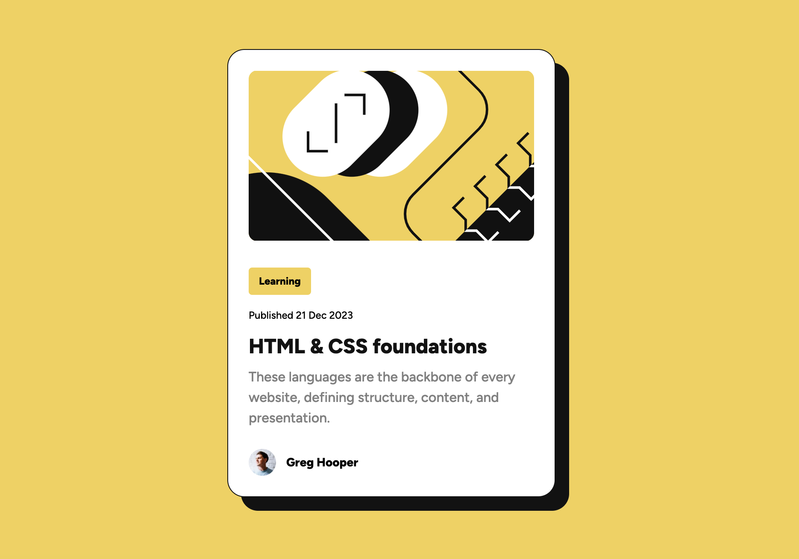

# Frontend Mentor - Blog preview card solution<!-- omit in toc -->

This is a solution to the [Blog preview card challenge on Frontend Mentor](https://www.frontendmentor.io/challenges/blog-preview-card-ckPaj01IcS). Frontend Mentor challenges help you improve your coding skills by building realistic projects.

## Final screenshot

## Table of contents<!-- omit in toc -->

- [Final screenshot](#final-screenshot)
- [Overview](#overview)
  - [The challenge](#the-challenge)
  - [Links](#links)
- [My process](#my-process)
  - [Built with](#built-with)

## Overview

### The challenge

Users should be able to:

- See hover and focus states for all interactive elements on the page

### Links

[Live site](https://blog-preview-card-project.netlify.app/)
 
[GitHub repo](https://github.com/jdwilkin4/frontend-mentor-monorepo-challenges/tree/main/blog-preview-card-main)

## My process

### Built with

- Semantic HTML5 markup
- SCSS
- Flexbox
- Mobile-first workflow
