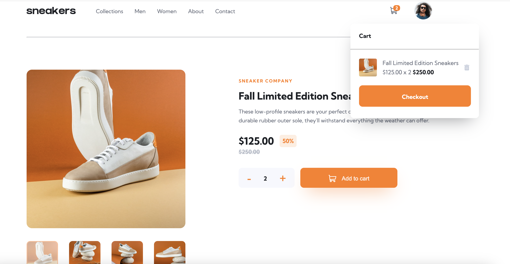

# Frontend Mentor - E-commerce product page solution<!-- omit in toc -->

This is a solution to the [E-commerce product page challenge on Frontend Mentor](https://www.frontendmentor.io/challenges/ecommerce-product-page-UPsZ9MJp6). Frontend Mentor challenges help you improve your coding skills by building realistic projects.

## Table of contents

- [Table of contents](#table-of-contents)
- [Screenshots](#screenshots)
  - [Desktop](#desktop)
- [Overview](#overview)
  - [The challenge](#the-challenge)
  - [Links](#links)
- [My process](#my-process)
  - [Built with](#built-with)

## Screenshots

### Desktop

## Overview

### The challenge

Users should be able to:

- View the optimal layout for the site depending on their device's screen size
- See hover states for all interactive elements on the page
- Open a lightbox gallery by clicking on the large product image
- Switch the large product image by clicking on the small thumbnail images
- Add items to the cart
- View the cart and remove items from it

### Links

- [Live site URL](https://ecommerce-app-frontend-mentor.netlify.app/) 
- [GitHub repo URL](https://github.com/jdwilkin4/frontend-mentor-monorepo-challenges/tree/main/ecommerce-project-page-main)

## My process

### Built with

- Semantic HTML5 markup
- CSS custom properties
- Flexbox
- Mobile-first workflow
- [React](https://reactjs.org/) - JS library
- [Vite](https://vitejs.dev/)
- [TypeScript](https://www.typescriptlang.org/)
- [SASS](https://sass-lang.com/)
