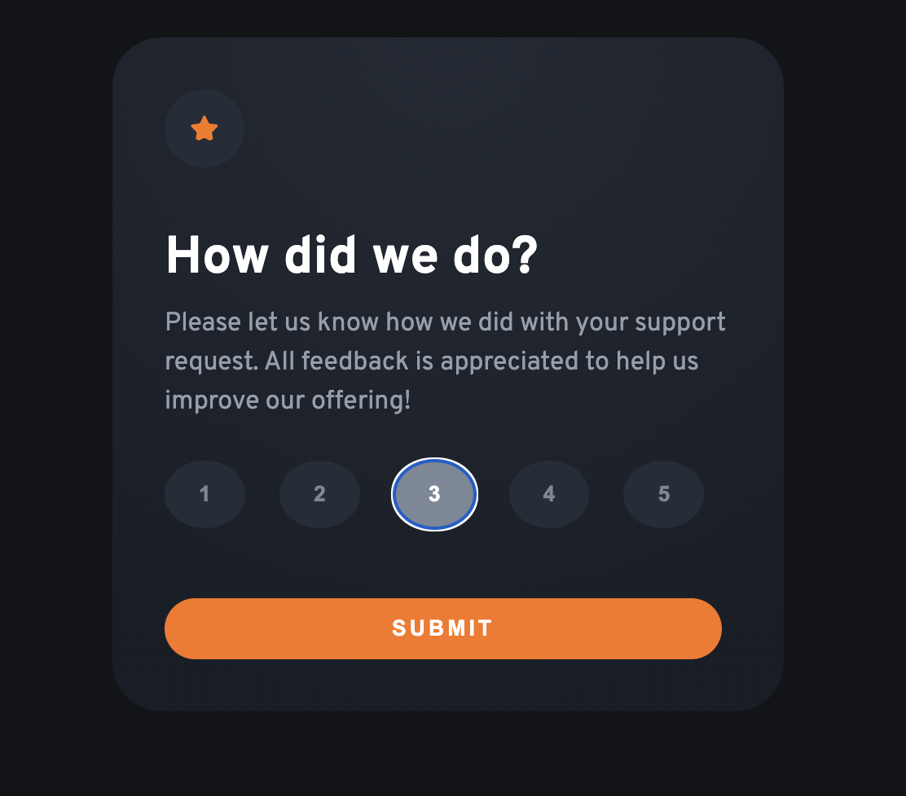

# Frontend Mentor - Interactive Rating component<!-- omit in toc -->

## Desktop

 

## Table of contents<!-- omit in toc -->

- [Desktop](#desktop)
- [Overview](#overview)
  - [The challenge](#the-challenge)
  - [Links](#links)
- [My process](#my-process)
  - [Built with](#built-with)

## Overview

### The challenge

Users should be able to:

- select a rating
- change their selection before submission
- submit a rating and the thank you screen should appear

### Links

- [GitHub repo URL](https://github.com/jdwilkin4/frontend-mentor-monorepo-challenges/tree/main/interactive-rating-component)
- [Live site](https://rating-project-fm.netlify.app/)

## My process

### Built with

- Semantic HTML5 markup
- CSS custom properties
- Flexbox
- Mobile-first workflow
- TypeScript
- [React](https://reactjs.org/) - JS library
- Playwright
