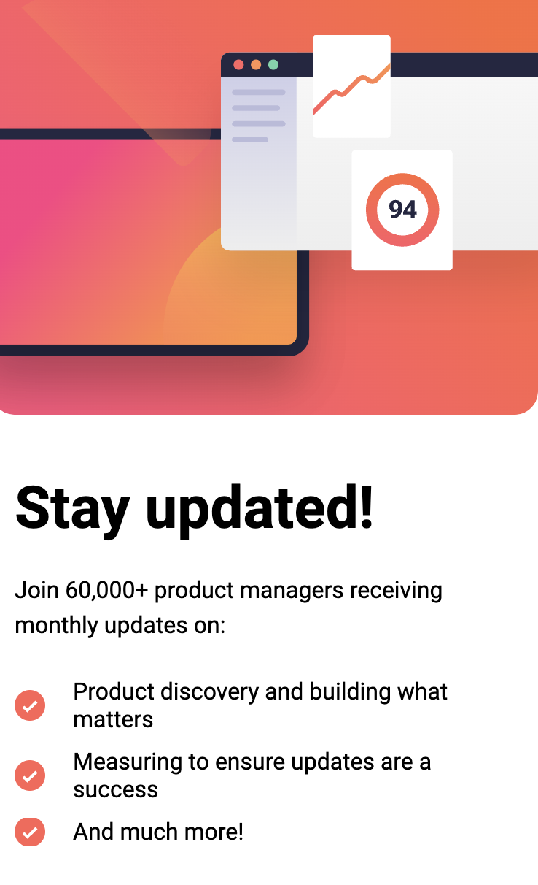

# Frontend Mentor - Newsletter sign-up form with success message solution<!-- omit in toc -->

## Mobile

## Desktop

 

 

## Table of contents<!-- omit in toc -->

- [Mobile](#mobile)
- [Desktop](#desktop)
- [Overview](#overview)
  - [The challenge](#the-challenge)
  - [Links](#links)
- [My process](#my-process)
  - [Built with](#built-with)

## Overview

### The challenge

Users should be able to:

- Add their email and submit the form
- See a success message with their email after successfully submitting the form
- See form validation messages if:
  - The field is left empty
  - The email address is not formatted correctly
- View the optimal layout for the interface depending on their device's screen size
- See hover and focus states for all interactive elements on the page

### Links

- [GitHub repo URL](https://github.com/jdwilkin4/frontend-mentor-monorepo-challenges/tree/main/newsletter-signup)
- [Live site](https://newsletter-signup-project.netlify.app/)

## My process

### Built with

- Semantic HTML5 markup
- CSS custom properties
- Flexbox
- Mobile-first workflow
- TypeScript
- [React](https://reactjs.org/) - JS library
- Playwright
